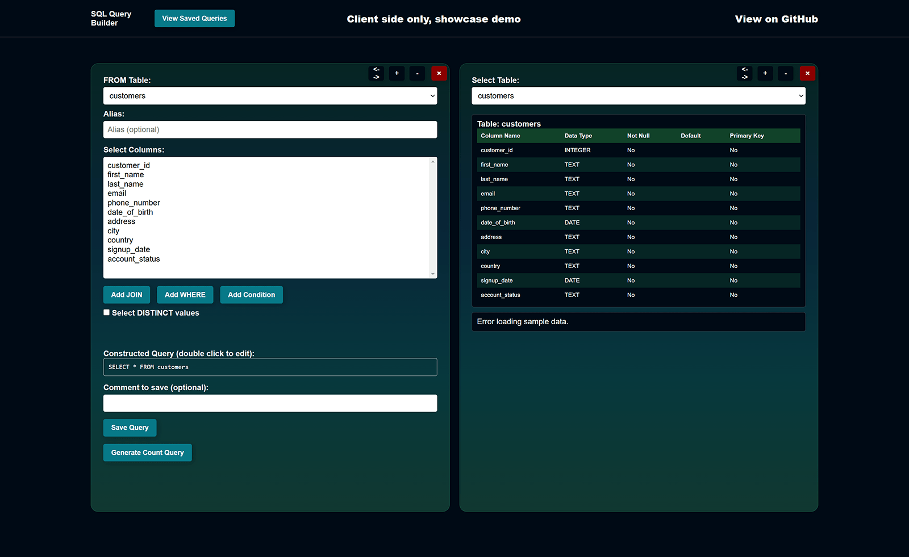

### SQL Developer veryLite.

Built to practice SQL, ended up practicing JavaScript instead.

1. Has decent UI and saved queries history.
2. Shows tables and columns.
3. Saves states to localstorage.
4. Can export query results and saved queries to CSV.
5. Python scripts to create a database and populate it with data. Dummy data in `/database/`
6. Branches:
    - Clientside with dummy json.
    - `flask: Postgre` version of the SQL query builder.
    - `nodejs: PostgreSQL` version of the SQL query builder 
    - `nodejs: SQLite` version of the SQL query builder 
7. Probably has bugs, and an unfinished converter features theory in public/js/whatever.js.
8. Small backend with basic `routing / models and controllers.`

 

[Client side v. demo](https://veryseriousbusiness.xyz/heroez/sql-query-builder/)

